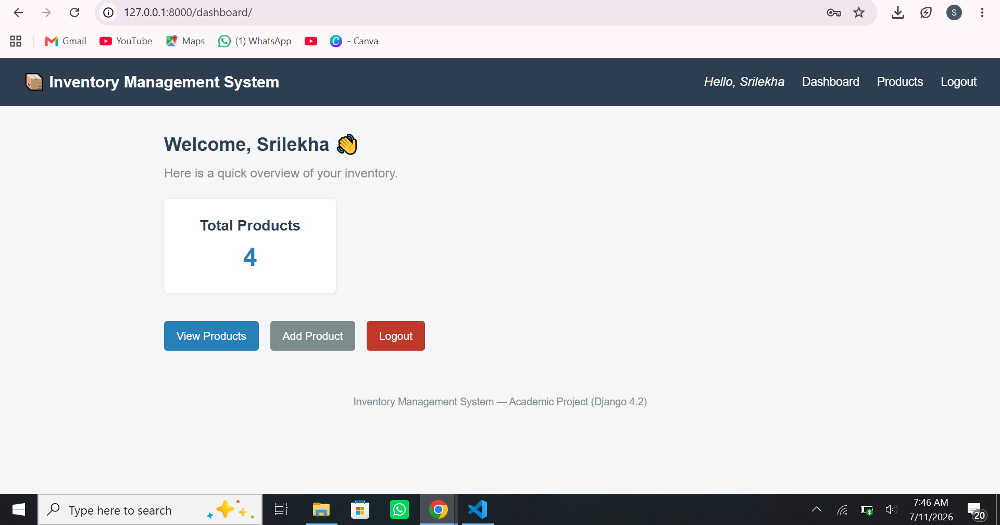
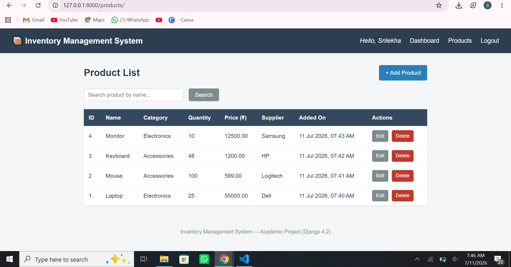
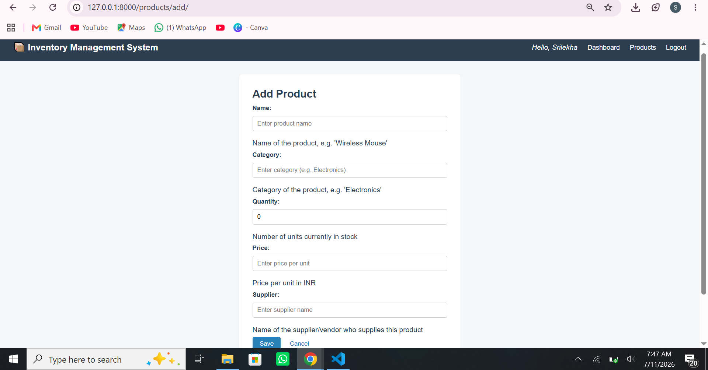
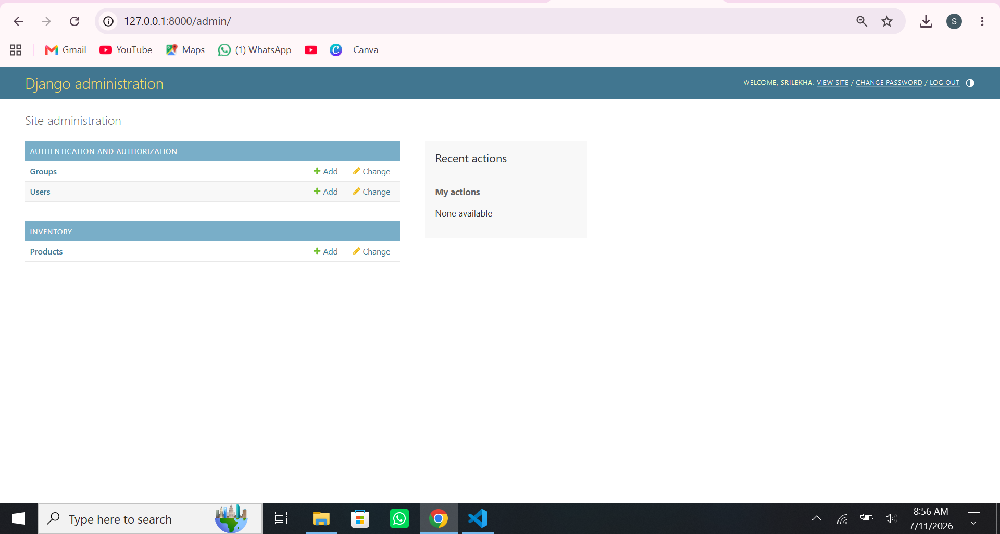

# 📦 Inventory Management System (Django)

A beginner-friendly, academic-style **Inventory Management System** built with **Django 4.2 (LTS)** and **SQLite**, using only **Function-Based Views (FBVs)**. This project was built as a final-year B.Tech mini-project / interview-preparation project (TCS Prime) and intentionally avoids complex tools (no REST APIs, no Bootstrap, no JavaScript frameworks, no Docker) so that every line of code can be explained confidently in an interview.

---

## 📖 Project Overview

The system allows an authenticated staff member (via Django login) to manage a simple product inventory: add new products, view/search the product list, update product details, and delete products. It also exposes the Product model through Django's built-in Admin site.

The goal of this project is **clarity over cleverness** — every file is small, readable, and heavily commented so a student can explain the "why" behind each design decision in a technical interview.

---

## ✨ Features

- 🔐 **Authentication** — Login / Logout using Django's built-in `django.contrib.auth` system
- 📊 **Dashboard** — Welcome message, total product count, quick navigation
- 🗃️ **Product CRUD** — Add, View, Update, Delete products
- 🔍 **Search** — Search products by name (case-insensitive)
- 🛠️ **Django Admin** — Product model registered and manageable from `/admin/`
- 🎨 **Vanilla CSS UI** — Clean, simple styling with no external frameworks

---

## 🛠️ Technologies Used

| Technology       | Purpose                                  |
|-------------------|-------------------------------------------|
| Python 3.10+      | Programming language                     |
| Django 4.2 (LTS)  | Web framework (MVT architecture)         |
| SQLite            | Lightweight, file-based database         |
| HTML5             | Page structure / Django templates        |
| CSS3 (Vanilla)    | Styling (no Bootstrap / Tailwind)        |
| Django ORM        | Database queries without raw SQL         |

---

## 📁 Folder Structure

```
inventory_management/
│
├── manage.py                     # Django's command-line utility
├── requirements.txt              # Python dependencies
├── README.md                     # Project documentation (this file)
├── db.sqlite3                    # SQLite database (created after migrate)
│
├── inventory_project/            # Project-level configuration
│   ├── __init__.py
│   ├── settings.py                # All project settings
│   ├── urls.py                    # Master URL routing
│   ├── wsgi.py                    # WSGI entry point (deployment)
│   └── asgi.py                    # ASGI entry point (deployment)
│
├── inventory/                    # Our main Django app
│   ├── __init__.py
│   ├── admin.py                    # Registers Product with Django Admin
│   ├── apps.py                     # App configuration
│   ├── forms.py                    # ProductForm (ModelForm)
│   ├── models.py                   # Product model (database schema)
│   ├── urls.py                     # App-level URL routing
│   ├── views.py                    # All Function-Based Views
│   └── migrations/                 # Auto-generated DB migration files
│       └── __init__.py
│
├── templates/                    # HTML templates (project-level)
│   ├── base.html                   # Shared layout (navbar, footer)
│   ├── login.html
│   ├── dashboard.html
│   ├── product_list.html
│   ├── product_form.html           # Shared by Add & Update
│   └── product_confirm_delete.html
│
└── static/
    └── css/
        └── style.css                # Vanilla CSS styling
```

---

## 🏗️ MVT Architecture

Django follows the **Model–View–Template (MVT)** pattern, Django's version of the classic MVC pattern:

- **Model** (`inventory/models.py`) — Defines the data structure (`Product`) and talks to the database using the Django ORM. Django translates each `Product` class into a SQL table (`inventory_product`).
- **View** (`inventory/views.py`) — Contains the business logic. Each view is a plain Python function that receives an `HttpRequest`, fetches/saves data via the Model, and returns an `HttpResponse` (usually via `render()` or `redirect()`).
- **Template** (`templates/*.html`) — The presentation layer. Templates receive data (a "context" dictionary) from the view and render it as HTML using Django's template language (`{{ variable }}`, ``).

**Request flow:** Browser → `urls.py` (matches URL to a view) → `views.py` (fetches/saves data using `models.py`) → `templates/*.html` (renders the final HTML) → Browser.

---

## 🗄️ Django ORM

Instead of writing raw SQL, this project uses Django's **Object-Relational Mapper (ORM)** — Python code that Django automatically converts into SQL statements for SQLite. Examples used in this project:

| ORM Code                                   | Equivalent SQL (conceptually)                           |
|---------------------------------------------|-----------------------------------------------------------|
| `Product.objects.all()`                     | `SELECT * FROM inventory_product;`                        |
| `Product.objects.count()`                   | `SELECT COUNT(*) FROM inventory_product;`                 |
| `Product.objects.filter(name__icontains=q)` | `SELECT * FROM inventory_product WHERE name LIKE '%q%';`  |
| `get_object_or_404(Product, pk=pk)`         | `SELECT * FROM inventory_product WHERE id = pk;` (+404 handling) |
| `form.save()` (new object)                  | `INSERT INTO inventory_product (...) VALUES (...);`       |
| `form.save()` (existing `instance=`)        | `UPDATE inventory_product SET ... WHERE id = pk;`          |
| `product.delete()`                          | `DELETE FROM inventory_product WHERE id = pk;`              |

---

## 🔐 Authentication

Authentication uses Django's built-in `django.contrib.auth` app — no custom user model or third-party library is required.

- **Login** (`login_view`) — validates credentials with `authenticate()`, then starts a session with `login()`.
- **Logout** (`logout_view`) — ends the session with `logout()`.
- **Protected pages** — the dashboard and all product CRUD views use the `@login_required` decorator, which automatically redirects anonymous users to the login page (`LOGIN_URL` in `settings.py`).
- **CSRF Protection** — every form includes ``, which Django's `CsrfViewMiddleware` verifies on every POST request to prevent cross-site request forgery attacks.

---

## 🔁 CRUD Operations

| Operation | URL                          | View                    | Template                        |
|-----------|-------------------------------|--------------------------|-----------------------------------|
| Create    | `/products/add/`              | `add_product_view`       | `product_form.html`              |
| Read      | `/products/`                  | `product_list_view`      | `product_list.html`              |
| Update    | `/products/<pk>/edit/`        | `update_product_view`    | `product_form.html`              |
| Delete    | `/products/<pk>/delete/`      | `delete_product_view`    | `product_confirm_delete.html`    |

All CRUD views use a single reusable `ProductForm` (a `ModelForm`), which auto-generates form fields and validation straight from the `Product` model.

---

## ⚙️ Installation Steps

1. **Clone or download this project**
   ```bash
   git clone <your-repo-url>
   cd inventory_management
   ```

2. **Create and activate a virtual environment** (recommended)
   ```bash
   python -m venv venv
   # Windows
   venv\Scripts\activate
   # macOS/Linux
   source venv/bin/activate
   ```

3. **Install dependencies**
   ```bash
   pip install -r requirements.txt
   ```

---

## ▶️ How to Run

1. **Apply database migrations** (creates the SQLite tables)
   ```bash
   python manage.py makemigrations
   python manage.py migrate
   ```

2. **Create a superuser** (for login + Django Admin access)
   ```bash
   python manage.py createsuperuser
   ```

3. **Run the development server**
   ```bash
   python manage.py runserver
   ```

4. **Open the app in your browser**
   - App: http://127.0.0.1:8000/
   - Admin: http://127.0.0.1:8000/admin/

5. Log in using the superuser credentials you created in step 2.

---

## 🚀 Future Improvements

- Add role-based access (Admin vs Staff users)
- Add pagination for large product lists
- Add category-wise filtering and stock-level alerts (low stock warnings)
- Add unit tests (`django.test.TestCase`) for models and views
- Add export-to-CSV/Excel functionality for reports
- Deploy to a cloud platform (Render/Railway/PythonAnywhere)

---

## 🖼️ Screenshots

### 🔐 Login Page


---

### 🏠 Dashboard



---

### 📋 Product List



---

### ➕ Add Product



---

### ⚙️ Django Admin Panel



## 💬 Interview Questions Based on This Project

1. **What is Django's MVT architecture, and how does it differ from MVC?**
2. **What is the difference between a Function-Based View (FBV) and a Class-Based View (CBV)? Why did you choose FBVs here?**
3. **What is the Django ORM, and why is it preferred over raw SQL?**
4. **Explain what happens internally when you call `Product.objects.all()`.**
5. **Why did you use `get_object_or_404()` instead of `Product.objects.get()`?**
6. **What is a `ModelForm`, and how is it different from a regular Django `Form`?**
7. **What does `@login_required` do, and how does Django know where to redirect an unauthenticated user?**
8. **What is CSRF, and how does `` protect against it?**
9. **Explain the request-response lifecycle in Django, from URL to Template.**
10. **What is the purpose of `urls.py`, and why do we use `include()` in the project-level `urls.py`?**
11. **What is the difference between `render()` and `redirect()`? When would you use each?**
12. **Why is `DecimalField` used for the `price` field instead of `FloatField`?**
13. **What is the purpose of migrations in Django? What is the difference between `makemigrations` and `migrate`?**
14. **How does Django's authentication system work internally (sessions, cookies, `auth_user` table)?**
15. **What is the difference between `GET` and `POST` requests, and why is the search form using `GET` while the login form uses `POST`?**
16. **What is the purpose of `settings.py`, and what are `INSTALLED_APPS` and `MIDDLEWARE`?**
17. **How would you add pagination to the product list page?**
18. **What is the Django Admin site, and how do you register a model with it?**
19. **How does Django prevent SQL injection when using the ORM?**
20. **How would you scale this project to use PostgreSQL instead of SQLite in production?**

---

## 📄 License

This project is created for academic and educational purposes.
